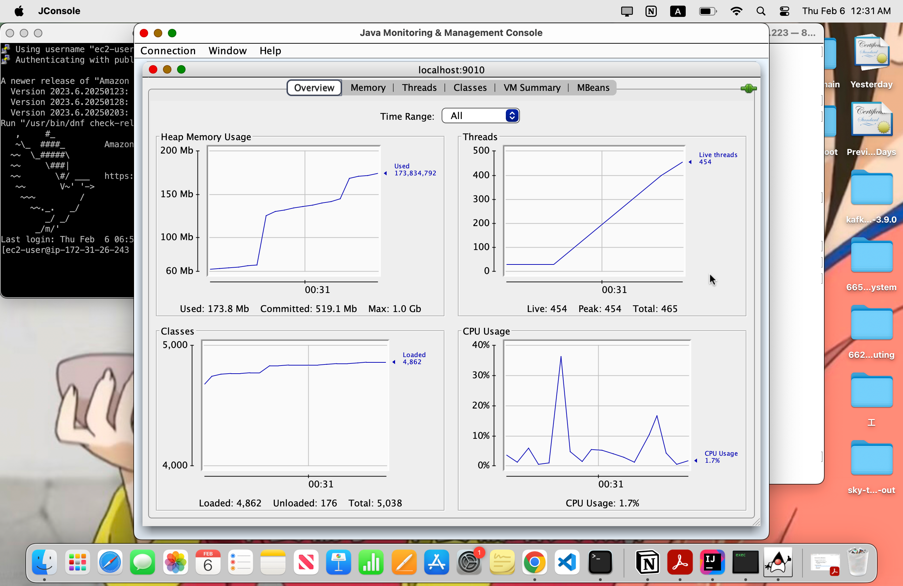
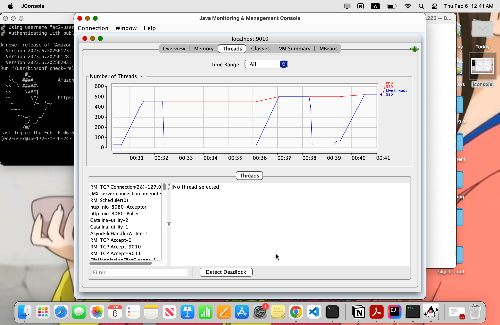

# Homework 3b: Simple Performance

1. Experiment with a simple load test with a servlet
2. Build a multithreaded servlet client using the Apache HttpClient library

**Experiment Result**
|Created Thread Number|Tomcat Max Thread Number|Respond Delay (ms)|Execution Time (ms)|
|---------------------|------------------------|------------------|-------------------|
|1|200|1000|1060|
|100|200|1000|1084|
|200|200|1000|1123|
|201|200|1000|2096|
|500|200|1000|3204|
|1000|200|1000|5301|
|1|100|1000|1060|
|100|100|1000|1091|
|101|100|1000|2094|
|200|100|1000|2130|
|500|100|1000|5261|
|1000|100|1000|10291|
|1|500|1000|1055|
|100|500|1000|1104|
|200|500|1000|1108|
|500|500|1000|1184|
|501|500|1000|2121|
|1000|500|1000|2303|
|1001|500|1000|3234|

**Observation:**
- Tomcat’s maxThreads is the bottleneck
- Excess requests must wait in a queue, causing delay

Observing the live threads number, I noticed that when the incoming request is fewer than Tomcat's maximum thread number, live threads have a positive corelation with incoming request number. However, when incoming request exceed that threshold, the live thread number will likely to be steady.

